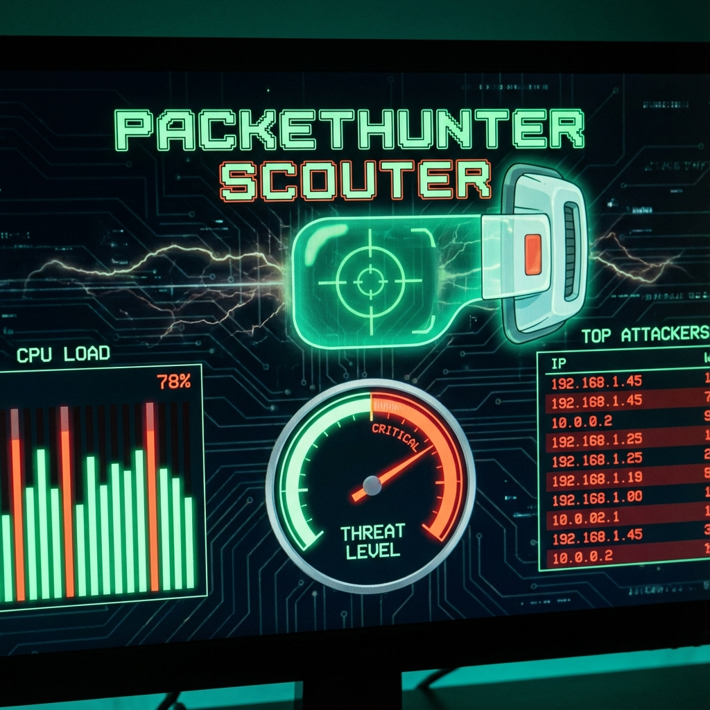
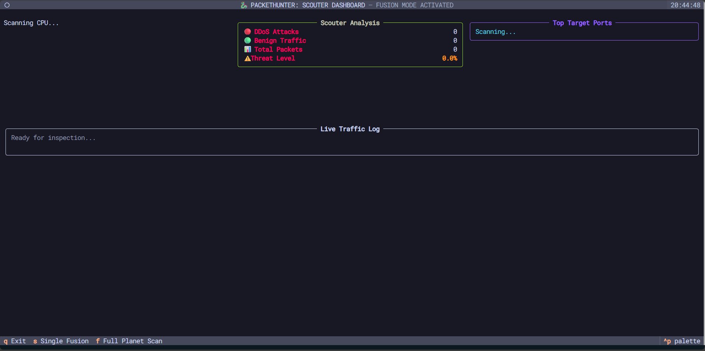
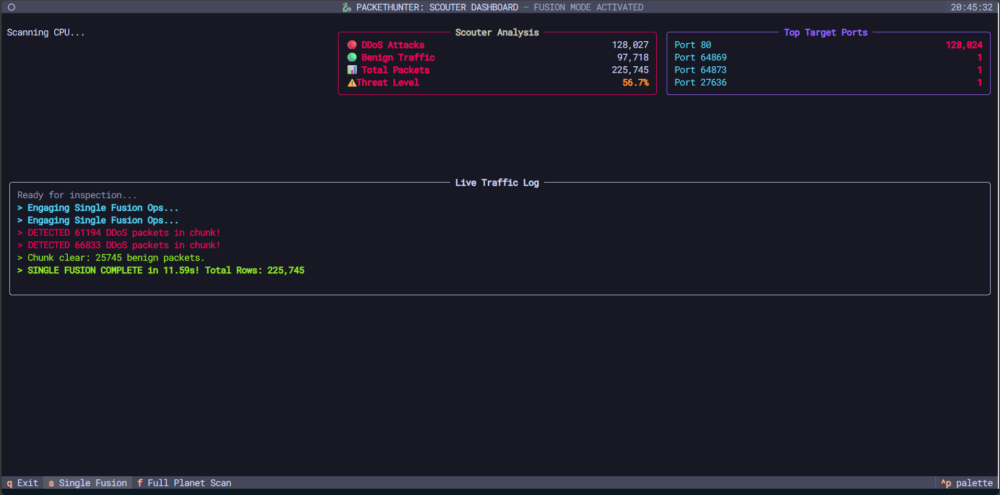
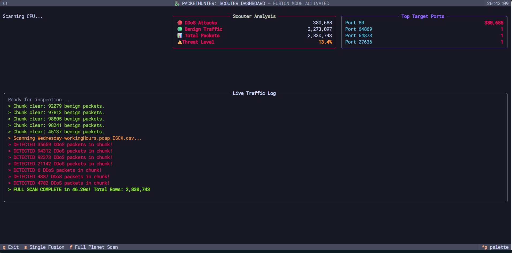
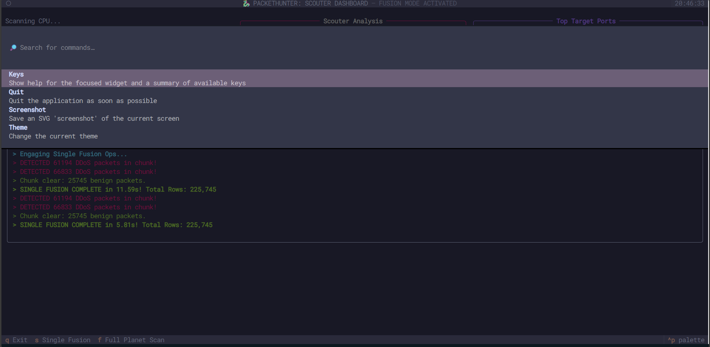
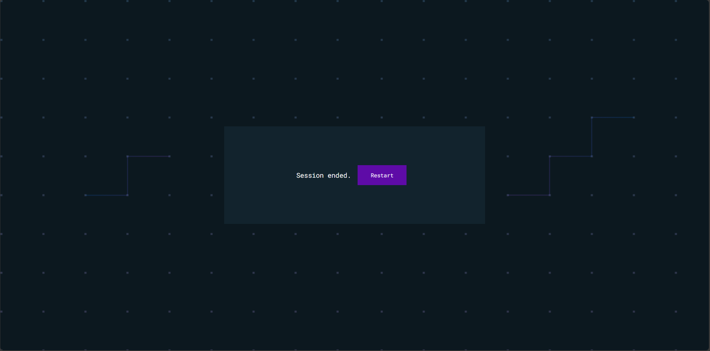

<div align="center">

# 🐉 PacketHunter

### *High-Performance DDoS Detection Engine*

[](https://python.org)
[](https://pandas.pydata.org)
[](https://textual.textualize.io)
[](LICENSE)

*A cybersecurity tool inspired by Dragon Ball's "Fusion" technique — combining the power of multiprocessing to detect DDoS attacks in massive network logs at lightning speed.*



</div>

---

##  Screenshots

<table>
<tr>
<td width="50%">

###  Dashboard Overview


*The main Scouter Dashboard interface showing real-time CPU monitoring, attack statistics, and the live traffic log panel.*

</td>
<td width="50%">

###  Fusion Mode Active


*The Fusion Engine engaged — multiprocessing in action, scanning network packets across all CPU cores simultaneously.*

</td>
</tr>
<tr>
<td width="50%">

###  DDoS Detection


*Real-time threat detection identifying malicious DDoS packets, with attack counters and top targeted ports analysis.*

</td>
<td width="50%">

###  Analysis Results


*Completed scan results showing total packets analyzed, DDoS vs benign traffic breakdown, and performance metrics.*

</td>
</tr>
<tr>
<td colspan="2" align="center">

###  Performance Benchmark


*Head-to-head comparison: Sequential "Base Form" vs Parallel "Fusion Mode" — demonstrating significant speed improvements using multiprocessing.*

</td>
</tr>
</table>

---

##  The Core Philosophy

This project follows the **Dragon Ball** methodology for high-performance computing:

| Mode | Description | Performance |
|:---:|:---|:---:|
|  **Base Form** | Single-core Pandas processing. Reliable, but slow. | 1x |
|  **Fusion Technique** | Multiprocessing Pool splitting logs into chunks for simultaneous scanning. | Up to 4x+ |
|  **The Scouter** | A Textual-based TUI dashboard providing real-time threat intelligence. | — |

---

##  Tech Stack

| Category | Technologies |
|:---|:---|
| **Language** | Python 3.9+ |
| **Data Processing** | Pandas, NumPy |
| **Terminal UI** | Textual, Rich |
| **Performance** | Python Multiprocessing (Pool) |
| **Monitoring** | psutil (CPU/Memory) |

---

##  Installation

```bash
# Clone the repository
git clone https://github.com/achrafS133/PacketHunter.git
cd PacketHunter

# Create virtual environment
python -m venv .venv

# Activate virtual environment
# Windows:
.\.venv\Scripts\activate
# Linux/Mac:
source .venv/bin/activate

# Install dependencies
pip install -r requirements.txt
```

---

##  Usage

### Launch the Scouter Dashboard (Terminal)

```bash
python main.py
```

### Launch in Web Browser

```bash
python serve_web.py
```
Then open: **http://127.0.0.1:8000**

### Keyboard Controls

| Key | Action |
|:---:|:---|
| `S` | **Single Fusion** — Analyze default dataset |
| `F` | **Full Planet Scan** — Analyze all CSVs in DATASET folder |
| `Q` | Exit the application |

---

##  Benchmarks

Run the performance showdown to compare sequential vs parallel processing:

```bash
# Sequential baseline
python benchmarks/01_sequential_baseline.py

# Parallel fusion mode
python benchmarks/02_parallel_fusion.py

# Full comparison
python benchmarks/performance_showdown.py
```

---

## 📂 Project Structure

```
PacketHunter/
├── 📁 packethunter/          # Core detection & multiprocessing logic
│   ├── config.py             # Configuration constants
│   ├── detector.py           # DDoS pattern analysis
│   └── fusion.py             # Multiprocessing engine
├── 📁 scouter/               # TUI Application components
│   ├── app.py                # Main Textual app
│   └── widgets/              # UI components (CPU, counters, etc.)
├── 📁 benchmarks/            # Performance testing scripts
├── 📁 DATASET/               # CIC-IDS2017 network logs
├── 📁 assets/                # Screenshots & images
├── main.py                   # Entry point
├── serve_web.py              # Web server for browser access
└── requirements.txt          # Dependencies
```

---

##  Dataset

This project uses the **CIC-IDS2017** dataset, a comprehensive intrusion detection dataset containing:

- **Benign traffic** — Normal network activity
- **DDoS attacks** — Distributed Denial of Service
- **DoS variants** — Slowloris, Hulk, GoldenEye, Slowhttptest

---

##  Contributing

Contributions are welcome! Feel free to:

1. Fork the repository
2. Create a feature branch (`git checkout -b feature/amazing-feature`)
3. Commit your changes (`git commit -m 'Add amazing feature'`)
4. Push to the branch (`git push origin feature/amazing-feature`)
5. Open a Pull Request

---

##  License

This project is licensed under the MIT License - see the [LICENSE](LICENSE) file for details.

---

<div align="center">

**Made with 🐉 by [Achraf](https://github.com/achrafS133)**

*"The power of Fusion... ACTIVATED!"*

</div>
